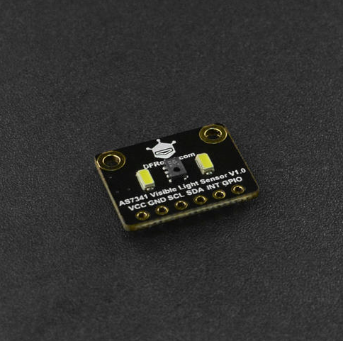

# DFRobot_AS7341
- [中文版](./README_CN.md)

We live in a colorful world, but how much do you really know about color? You eyes may deceive you, while the sensors don’t lie. This AS7341sensor can tell you the truth about color. <br> 
AS7341 Visible Light Sensor employs the new generation of AS7341 spectral sensor IC launched by the well-known AMS company. The sensor features eight channels for the visible light, one channel for near-IR, and one channel without a filter. Also it integrates a dedicated channel to detect ambient light flicker. Besides that, this sensor comes with 6 independent 16-bit ADC channels for data processing in parallel. The two on-board extra-bright LEDs can supply light in dark environment.



## Product Link (https://www.dfrobot.com/product-2132.html)
    SEN0365: Fermion: AS7341 11-Channel Visible Light Sensor (Breakout)
	
## Table of Contents

* [Summary](#summary)
* [Installation](#installation)
* [Methods](#methods)
* [Compatibility](#compatibility)
* [History](#history)
* [Credits](#credits)

## Summary
1.Read the value of each channel<br>
2.Detect whether the frequency of light source flickering is 50HZ or 60HZ


## Installation

To use this library, first download the library file, paste it into the \Arduino\libraries directory, then open the examples folder and run the demo in the folder.

## Methods
```C++
  /**
   * @fn begin
   * @brief init function
   * @param mode data read mode
   * @return return 0 if the initialization succeeds, otherwise return non-zero and error code.
   */
  int begin(eMode_t mode = eSpm);

  /**
   * @fn readID
   * @brief read sensor ID
   * @return the read sensor ID, one byte 
   */
  uint8_t readID();
  
  /**
   * @fn setAtime
   * @brief Set the value of register ATIME, through which the value of Integration time can be calculated. The value represents the time that must be spent during data reading.
   * @param value the value of register ATIME
   */
  void setAtime(uint8_t value);
 
  /**
   * @fn setAstep
   * @brief Sets the integration time per step
   * @param value the value of register Astep
   */
  void setAstep(uint16_t value);

  /**
   * @fn setAGAIN
   * @brief Set gain value (0~10 corresponds to X0.5,X1,X2,X4,X8,X16,X32,X64,X128,X256,X512)
   * @param value The value of register CFG1
   */
  void setAGAIN(uint8_t value);

  /**
   * @fn setWtime
   * @brief Set Set the value of WTIME, through which wite time can be calculated. The value represents the time that
   * @ must be spent during data reading.
   * @param value The value of WTIME
   */
  void setWtime(uint8_t value);
  
  /**
   * @fn startMeasure
   * @brief Start spectrum measurement 
   * @param mode Channel mapping mode: 1.eF1F4ClearNIR,2.eF5F8ClearNIR
   */
  void startMeasure(eChChoose_t mode);

  /**
   * @fn readSpectralDataOne
   * @brief Read the value of sensor data channel 0~5, under eF1F4ClearNIR
   * @return The value of channel  ADF1,ADF2,ADF3,ADF4,ADCLEAR and ADNIR
   */
  
  sModeOneData_t readSpectralDataOne();
  
  /**
   * @fn readSpectralDataTwo
   * @brief Read the value of sensor data channel 0~5, under eF5F8ClearNIR
   * @return The value of channel ADF5,ADF6,ADF7,ADF8,ADCLEAR and ADNIR
   */
  sModeTwoData_t readSpectralDataTwo();
  
  /**
   * @fn readFlickerData
   * @brief Read the value of register flicker, through which the flicker frequency of the light source can be predicted
   * @return The data of register flicker
   */
  uint8_t readFlickerData();
 
  /**
   * @fn measureComplete
   * @brief Set measurement mode 
   * @return Boolean type, the result of measure
   * @retval true measurement completed
   * @retval false Incomplete measurement
   */
  bool measureComplete();
  
  /**
   * @fn setGpioMode
   * @brief Set the electrical parameters of GPIO pins 
   * @param mode INPUT and OUTPUT
   */
  void setGpioMode(uint8_t mode);

  /**
   * @fn enableSpectralMeasure
   * @brief enable spectral measurement
   * @param on true：enable，false：disable   
   */
  void enableSpectralMeasure(bool on);
  
  /**
   * @fn enableLed
   * @brief whether to use LED lights
   * @param on true：yes，false：no  
   */
  void enableLed(bool on);
  
  /**
   * @fn controlLed
   * @brief Set the brightness level of led  
   * @param current brightness level (1~20 corresponds to current 4mA,6mA,8mA,10mA,12mA,......,42mA)
   */
  void controlLed(uint8_t current);
```

## Compatibility

MCU                | Work Well    | Work Wrong   | Untested    | Remarks
------------------ | :----------: | :----------: | :---------: | -----
Arduino Uno        |      √       |              |             | 
Mega2560        |      √       |              |             | 
Leonardo        |      √       |              |             | 
ESP32        |      √       |              |             | 
ESP8266        |      √       |              |             | 
M0        |      √       |              |             | 


## History

- 2020/07/31  - Version 1.0.0 released.

## Credits

Written by fengli(li.feng@dfrobot.com), 2020.7.31 (Welcome to our [website](https://www.dfrobot.com/))


